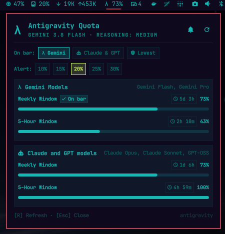

# OmaAntigravity — Antigravity CLI Usage & Quota Plugin for Omarchy

An Omarchy shell bar widget and popup panel plugin that monitors and displays **Google Antigravity CLI** (`agy`) limits, 5-hour rolling windows, weekly quotas, and active model status in real time.

---

## Features & Benefits

- **At-a-Glance Quota in Your Bar**: Real-time remaining quota displayed directly on your status bar (`λ 86%`). Automatically turns urgent red with an alert glyph (`󰀨`) when quota is low.
- **Interactive Metric Selector**: Minimalist rectangular chips in the panel to select which metric the bar tracks:
  - **Gemini**: Shows the most constrained limit for Gemini models (Flash, Pro).
  - **Claude & GPT**: Shows the most constrained limit for third-party models (Opus, Sonnet, GPT-OSS).
  - **Lowest**: Dynamically tracks the absolute lowest limit across all groups and windows.
- **Pin Any Specific Limit**: Click any individual 5-hour or weekly progress bar in the panel to pin that exact limit to the status bar (indicated by a clean `󰄬 On bar` badge).
- **Customizable Alert System**:
  - Configurable alert threshold percentage (default: **20%** remaining).
  - Prominent in-panel alert banner highlighting critical quotas and their exact reset countdown.
  - Native desktop notifications via `notify-send` when limits drop to or below your threshold.
  - In-panel quick selectors (`[10%]`, `[15%]`, `[20%]`, `[25%]`, `[30%]`) and a mute/unmute toggle (`[󰂚 Notify]` / `[󰂛 Muted]`).
- **Antigravity Branding & Active Model**:
  - Displays the official vibrant Antigravity arch logo with transparent background.
  - Shows the currently selected model and reasoning effort tier (e.g. `Gemini 3.8 Flash · Reasoning: Medium`).
- **Compact Non-Scroll Design**: Fully fitted layout tailored to Omarchy's design language (`Style.cornerRadius`, no scrollbars).
- **Instant Launch via Local Cache**: Loads immediately from local cache (`~/.cache/omarchy/antigravity-usage.json`) without lag, refreshing fresh data in the background.
- **Full Keyboard Navigation**: Press <kbd>R</kbd> in the panel to force refresh, <kbd>Esc</kbd> to close.

---

## Installation

Install directly using Omarchy's official plugin manager:

```bash
# Add and enable the plugin in your Omarchy status bar
omarchy plugin add https://github.com/slanger/omaantigravity.git --enable
```

If you wish to position it in a specific bar section (e.g. `right`):

```bash
omarchy plugin enable omaantigravity --section right
```

To update the plugin to the latest version at any time:

```bash
omarchy plugin update omaantigravity
```

---

## Configuration Options

Settings can be toggled directly in the panel UI, configured via `omarchy bar set`, or specified in `~/.config/omarchy/shell.json`:

| Option | Type | Default | Description |
| --- | --- | --- | --- |
| `barMetric` | enum | `"gemini"` | Quota limit to show on the bar: `gemini`, `3p`, `lowest`, `gemini-5h`, `gemini-weekly`, `3p-5h`, `3p-weekly` |
| `alertThresholdPct` | integer | `20` | Threshold percentage (5% – 50%) for low quota alerts |
| `enableNotifications` | boolean | `true` | Send desktop notifications via `notify-send` when quota is critical |
| `showPercentageInBar` | boolean | `true` | Display remaining percentage next to the bar icon |
| `pollIntervalSec` | integer | `300` | Background refresh interval in seconds (30s – 3600s) |
| `barIcon` | string | `"λ"` | Icon glyph displayed on the bar |

### CLI Configuration Examples

```bash
# Set metric to Gemini models (default)
omarchy bar set omaantigravity barMetric gemini

# Set metric to Claude and GPT models
omarchy bar set omaantigravity barMetric 3p

# Set metric to overall lowest remaining quota
omarchy bar set omaantigravity barMetric lowest

# Pin to a specific window
omarchy bar set omaantigravity barMetric gemini-5h
omarchy bar set omaantigravity barMetric gemini-weekly

# Change the critical alert threshold (e.g. to 25%)
omarchy bar set omaantigravity alertThresholdPct 25 --json

# Toggle desktop notifications
omarchy bar set omaantigravity enableNotifications false --json

# Change poll interval (e.g. every 2 minutes)
omarchy bar set omaantigravity pollIntervalSec 120 --json
```

---

## Panel Controls & Shortcuts

| Action | Shortcut / Trigger |
| --- | --- |
| **Open / Close Panel** | Left-click bar widget or press <kbd>Esc</kbd> |
| **Force Fresh Refresh** | Right-click / Middle-click bar widget or press <kbd>R</kbd> inside panel |
| **Switch Active Group** | Click `[Gemini]`, `[Claude & GPT]`, or `[Lowest]` chips |
| **Pin Specific Limit** | Click any progress bar row in the panel |
| **Set Alert Threshold** | Click `[10%]`, `[15%]`, `[20%]`, `[25%]`, or `[30%]` chips |
| **Toggle Notifications** | Click `[󰂚 Notify]` / `[󰂛 Muted]` button |
| **IPC Controls** | `omarchy-shell omaantigravity toggle`, `open`, `close`, `refresh`, `state` |

---

## CLI Script Usage

The backend query engine `scripts/fetch_usage.py` can also be run standalone:

```bash
# Return cached data if recent (<300s), otherwise fetch fresh from agy
./scripts/fetch_usage.py --cached

# Force a fresh real-time fetch from agy
./scripts/fetch_usage.py --force

# Return current cache immediately without waiting
./scripts/fetch_usage.py --cached-only
```

---

## Plugin Management

```bash
# List all discovered plugins and their status
omarchy plugin list

# Validate plugin manifest and schema
omarchy plugin validate ~/.config/omarchy/plugins/omaantigravity

# Disable plugin from status bar
omarchy plugin disable omaantigravity

# Remove plugin
omarchy plugin remove omaantigravity
```

---

## Disclaimer

All product names, logos, brands, trademarks, and registered trademarks mentioned in this project (including **Google**, **Google Antigravity**, **Gemini**, **Anthropic**, **Claude**, **OpenAI**, and **GPT**) are the property of their respective owners. 

All company, product, and service names used in this software and documentation are for identification, reference, and interoperability purposes only. Use of these names, logos, and brands does not imply endorsement, affiliation, or sponsorship.

<p align="center">
  
</p>

---

## License

MIT
